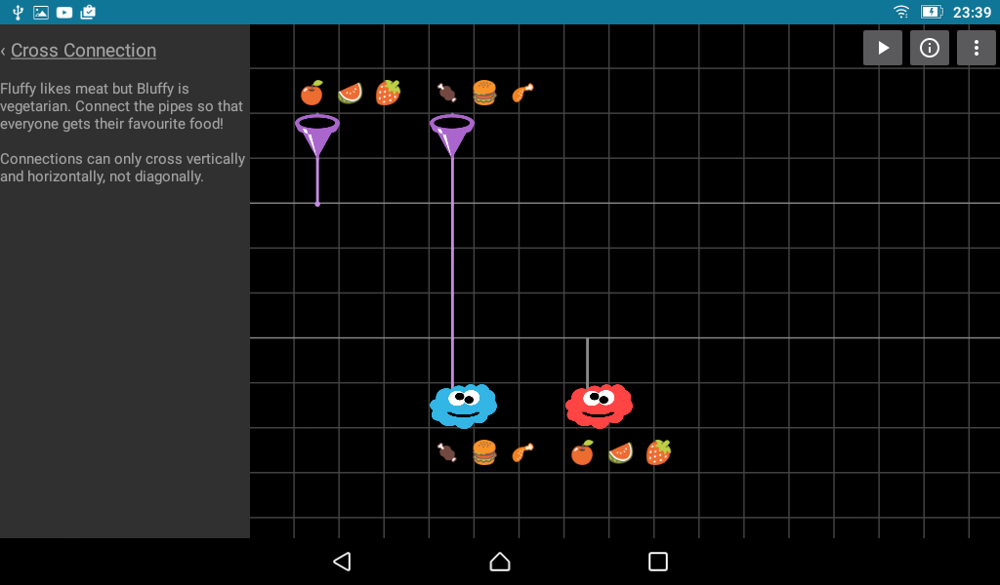

# FlowGrid

FlowGrid is a visual dataflow programming environment for Android. The main difference to other
visual programming apps such as [Scratch](https://scratch.mit.edu/) is that FlowGrid is based on
modelling data flow directly instead of traditional structured programming.

Basically, instead of using an indirection via variables or registers, the flow of information
through the computer is modelled in a graph, making programs look more like flow chart diagrams.
At the top level, this flow can be easily visualized, potentially making programming also more
accessible.

When the program is executed, flowgrid shows the flow of information through the program:

## Where is the App?

Download the public alpha from <https://play.google.com/apps/testing/org.flowgrid>.

## What is it good for?

The main motivation for building FlowGrid was that text input is quite horrible on most
mobile devices. So I wanted to explore a different approach to programming that is a better
fit for a touch based interface. The inspiration for using a Grid to make sure that the programs
look relatively tidy came from MineCraft and "Flow Free"-style mobile games.
Building something like IFTTT crossed with Redstone blocks on steroids just seemed like a
natural fit for tablets and phones.

Possible applications are:

- Simple simulations, converters or games
- Apps utilizing or rendering device sensor data
- Controlling an Arduino board via Firmata (requires a device with USB OTG support)
- Implementing actual real [spaghetti code](img/spaghetticode.png) :)

Also, the tutorials should make it easy to learn programming with a data flow paradigm.

I haven't built a turing machine in FG yet, but I am quite confident it is computational
complete since it supports recursion.

## What is it not so good for?

FlowGrid is currently not really suitable for data- or UI heavy apps. While it is possible to 
create home screen icons for individual FG progams, it's not really easy to share apps yet.

## Tutorials

To get a basic understanding of the editor and concepts, FlowGrid provides a set of increasingly
sophisticated tutorials in the “missions” section of the App. Before diving deeper into developing
custom programs with FlowGrid, I’d recommend to play through some of them to become familiar with
the operation editor.

## Help!

I have been working on this side project for quite a while now (about two years, taking up most of
my spare time) and thought it might be a good idea to get some wider feedback before sinking
more time into this and launching the app publicly on the Google Play Store. In particular, I'd be
interested in any "real world" use cases -- or suggestions for making this suitable for realistic
ones.

- What are good use cases that fit to the strenghts of this app?
- What is missing?
- Do you have suggestions for additional tutorials in the "missions" section?
- What in particular needs better documentation  (I know, everything! What
  is surprising / unexpected / confusing?) ?

Please post feedback in the corresponding
[G+-group](https://plus.google.com/u/0/communities/116001482434880598082),
[file an issue](https://github.com/FlowGrid/flowgrid-android/issues) or send feedback to
feedback@flowgrid.org.

## Source Dependencies

FlowGrid Android depends on:

- https://github.com/FlowGrid/flowgrid-core
- https://github.com/kobjects/emoji
- https://github.com/kobjects/filesystem

## Language Concepts, Editor and API documentation

Links:

- [Languagce concepts](https://github.com/FlowGrid/flowgrid-android/blob/master/src/main/assets/documentation.md)
- [User interface](https://github.com/FlowGrid/flowgrid-android/blob/master/src/main/assets/ui.md)
- [System library](https://github.com/FlowGrid/flowgrid-android/blob/master/src/main/assets/api.md)

## Known Issues / Todos

- Editor
  - When adding a constant to an input, the type should be inferred
  - When adding an output port to an existing connection, the type should be inferred
  - The array editor should support drag and drop
  - It should be possible to pull connection out of unconnected branches

- Synchronization
  - Reduce logspam
  - Improve reload triggering
  - Use drive query to synchronize faster and to make delete work more reliable

- API
  - Should add some time / date stuff
  - There are huge gaps when dealing with arrays / lists / vectors.
  - A way to trigger an activity
  - Some form of intent / external event handling capabilities?

- Documentation
  - Full system library documentation
  - Switch vs. Filter vs. Compute
  - Make sure all 3rd party stuff is mentioned in the copyright section

- Code
  - Move to support library fragments

- Building
  - Make it easier to build the project
